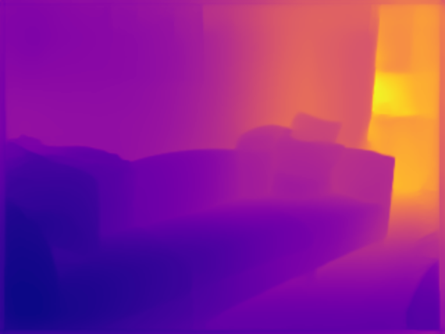
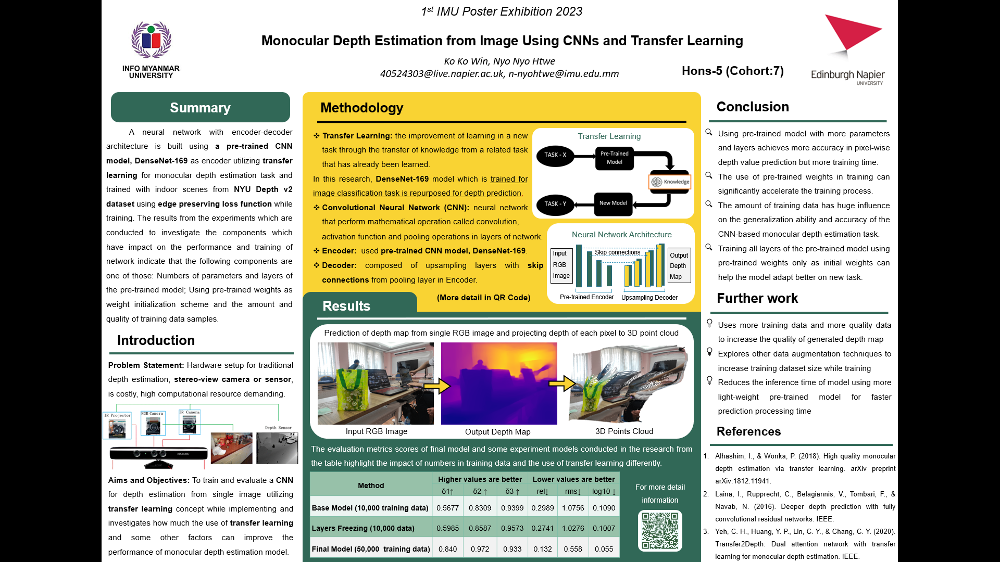

# MonoDepth_Transfer
Monocular Depth Estimation from Image Using CNNs and Transfer Learning

Example use of monocular depth estimation from single image in real world

  

Multi-layered image depth effect in IOS version 16 (Released in September, 2022)
- This feature combined the monocular depth estimation of image with 3D object rendering with depth value to make occlusion aware 3D object rendering

How depth estimation is used in occlusion aware Augmented Reality 3D object rendering

  

ARcore occlusion dense depth AR effect (Released in October, 2020)
- This feature contains the use of Visual Simultaneous Localization and Mapping (vSLAM), the process of calculating the position and orientation of a camera with respect to its surroundings while simultaneously mapping the environment. With the use of vSLAM, the depth of scene is estimated and combine with 3D object rendering.

Traditional way of depth estimation before

  

  

