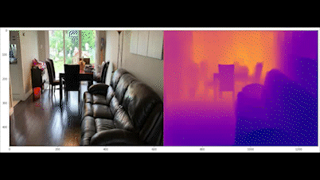
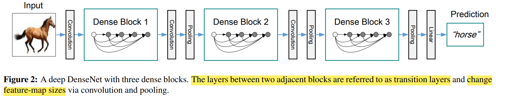

# MonoDepth_Transfer: Monocular Depth Estimation from Image Using CNNs and Transfer Learning
When an image is captured, the 3-dimensional scene are projected onto a 2D plane which results in the loss of relative distance information for each point. 
The image with those distance information for each pixel point is called depth maps. 
This research is generating or pixel-wise prediction of depth information from 2D single RGB image by creating a CNN utilizing transfer learning.
 
Example Input RGB images and Output Depth maps

  

 
Depth Estimation from a Video

  

 

The estimated depht values of each pixel are projected in 3D space as 3D points cloud

  

  

  

# Example use of monocular depth estimation from single image in real world
 

  

Multi-layered image depth effect in IOS version 16 (Released in September, 2022)
- This feature combined the monocular depth estimation of image with 3D object rendering with depth value to make occlusion aware 3D object rendering

  
# How depth estimation is used in occlusion aware Augmented Reality 3D object rendering
 

  

ARcore occlusion dense depth AR effect (Released in October, 2020)
- This feature contains the use of Visual Simultaneous Localization and Mapping (vSLAM), the process of calculating the position and orientation of a camera with respect to its surroundings while simultaneously mapping the environment. With the use of vSLAM, the depth of scene is estimated and combine with 3D object rendering.

  

# Traditional way of depth estimation before
Use triangulation process to get spare depth information. The hardware set up and calculation of these 
approaches are complex and the estimated depth information can be inaccurate due to the ambiguity or occlusion problem in different viewpoints of the cameras. 

  

  

# Depth Estimation using pre-trained CNN, DenseNet-169 as Encoder
The architecutre of base DenseNet model contain 4 Dense blocks

  

 

Each Dense block contains certain number of Dense Layers based on the DenseNet model number

  

 

The number of the layers varied based on the variation of pre-trained DenseNet model

  

 

# Decoder with Upsampling Layers
The decoder contain upsmaling layer to enlarge the downsampled, shrinked in resolution, of input image as feature maps.

  

 

# Layers in Encoder-Decoder Architecture

  

 

